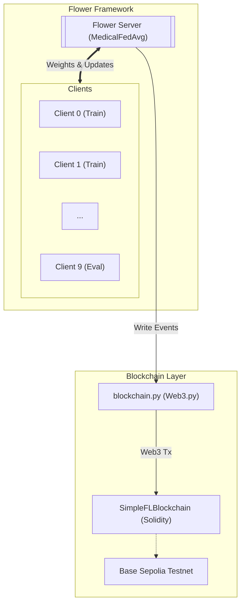

# Blockchain-Based Federated Learning for ECG Superclass Classification

> **Course project** — Federated learning over the PTB-XL dataset with an Ethereum smart-contract ledger for auditability and tamper-proof model tracking.

---

## Table of Contents

1. [Overview](#overview)
2. [System Architecture](#system-architecture)
3. [Project Structure](#project-structure)
4. [How It Works](#how-it-works)
   - [The Model](#the-model)
   - [Data Pipeline](#data-pipeline)
   - [Federated Learning Loop](#federated-learning-loop)
   - [Blockchain Ledger](#blockchain-ledger)
   - [Voting & Filtering](#voting--filtering)
5. [Research Background](#research-background)
6. [Requirements](#requirements)
7. [Setup & Installation](#setup--installation)
8. [Configuration](#configuration)
9. [Launching the Experiment](#launching-the-experiment)
10. [Outputs](#outputs)
11. [Smart Contract](#smart-contract)
12. [Limitations & Future Work](#limitations--future-work)

---

## Overview

This project implements a **federated learning (FL) system** for 12-lead ECG classification that records every training event — local model updates, voting decisions, and aggregated global models — to an **Ethereum blockchain** (Base Sepolia testnet) via a custom Solidity smart contract.

**Clinical task:** Classify each ECG recording into one or more of **5 superclasses** defined by the PTB-XL standard:

| Code | Superclass | Example diagnoses |
|------|-----------|-------------------|
| NORM | Normal | — |
| MI | Myocardial Infarction | IMI, AMI, ASMI … |
| STTC | ST/T-Change | NDT, ISC\_, ISCAL … |
| CD | Conduction Disturbance | LBBB, RBBB, WPW … |
| HYP | Hypertrophy | LVH, RVH … |

The dataset is partitioned across **10 simulated clients**, each training a local model on its own shard. A central server aggregates the models each round, evaluates the global model, and writes an immutable summary to the blockchain.

---

## System Architecture



---

## Project Structure

```
fl_blockchain_evm/
├── task.py                  # Dataset, model definition, train/test logic
├── client_app.py            # Flower client (train + evaluate handlers)
├── server_app.py            # Flower server (aggregation, evaluation, blockchain writes)
├── blockchain.py            # Web3 wrapper for the smart contract
├── priority_strategy.py     # MedicalFedAvg — equal-weight aggregation strategy
│
├── SimpleFLBlockchain.sol   # Solidity smart contract (deployed via Remix IDE)
├── FLBlockchain_abi.json    # ABI copied from Remix after deployment
│
├── data/
│   └── ptb-xl/              # PTB-XL dataset (downloaded separately)
│
├── outputs/                 # Auto-created at runtime
│   ├── results.json         # Per-round training & evaluation metrics (JSONL)
│   └── cm_round_N.png       # Confusion matrix plots per round
│
├── final_model.pt           # Saved global model weights after all rounds
│
├── .env                     # Secrets (not committed)
├── pyproject.toml           # Flower project config & hyperparameters
└── README.md
```

---

## How It Works

### The Model

**`Net`** (`task.py`) is a 4-stage **SE-ResNet** (Squeeze-and-Excitation Residual Network) for 1-D time-series:

```
Input: (B, 12, 1000)   — batch × 12 leads × 1000 time-steps @ 100 Hz
  └─ InputBN
  └─ Stage 1: Conv1d(12→32, k=15) → BN → ReLU → MaxPool(4) → 2× SEResBlock(32, k=7)
  └─ Stage 2: Conv1d(32→64, k=7)  → BN → ReLU → MaxPool(4) → 2× SEResBlock(64, k=5)
  └─ Stage 3: Conv1d(64→128, k=5) → BN → ReLU → MaxPool(2) → 2× SEResBlock(128, k=3)
  └─ Stage 4: Conv1d(128→256, k=3)→ BN → ReLU → MaxPool(2) → 1× SEResBlock(256, k=3)
  └─ GlobalAvgPool → Dropout(0.3) → Linear(256→5)
Output: (B, 5) raw logits  — multi-label sigmoid classification
```

~200K parameters. The SE block applies per-channel attention after each residual pair.

**Loss:** `FocalLoss` (γ=2, class-frequency alpha weights) — addresses the severe class imbalance in PTB-XL (NORM ≫ HYP/MI).

**Optimizer:** `AdamW` with cosine-annealing LR schedule and a linear warm-up for the first 10% of steps.

**Training augmentations** (applied per mini-batch):
- Gaussian noise (σ=0.05, p=0.8)
- Per-lead amplitude scaling (×0.8–1.2, p=0.5)
- Temporal shift (±30 samples, p=0.5)
- Baseline wander (sinusoidal, p=0.3)
- Mixup (α=0.3)

### Data Pipeline

PTB-XL uses the official 10-fold stratified split:

- **Folds 1–8** → training set (partitioned across clients)
- **Folds 9–10** → held-out test set (used for global evaluation only)

Each client receives a **sequential shard** of the shuffled training set (seed=42). Per-client z-score normalization is applied using that client's own training statistics.

To address the multi-label class imbalance, each client applies **ROS+RUS** (Random Over/Under Sampling) before training:

```
target = m_s + (m_l - m_s) × β      (β=1.0 → full equalization)
```

where `m_l` = largest class count, `m_s` = smallest class count. Under-represented classes are oversampled; over-represented classes are subsampled. A `WeightedRandomSampler` further reinforces balance during batching.

**Threshold optimization:** At evaluation time, per-class thresholds are tuned over `[0.05, 0.95]` in 0.02 steps to maximize per-class F1 (rather than using a fixed 0.5).

### Federated Learning Loop

Each round:

1. **Server** broadcasts the current global model weights to all selected clients.
2. **Each client** receives the weights, fine-tunes for `local-epochs` using its local shard, and returns the updated weights + scalar metrics (loss, samples, training time, active classes).
3. **Server** aggregates via `MedicalFedAvg` — a `FedAvg` variant that forces equal contribution weight (`weight=1`) for every client regardless of shard size, preventing large-shard clients from dominating.
4. **Global evaluation** is performed on the held-out test set (partition 0 used as proxy for the full test set).
5. **Blockchain** records three block types for the round (see below).

### Blockchain Ledger

`EVMBlockchain` (`blockchain.py`) wraps the deployed Solidity contract via **web3.py**. Every round writes the following blocks on-chain:

| Block type | When written | Payload stored |
|------------|-------------|----------------|
| `LOCAL` | After each client trains | `client_id`, `train_loss`, `num_examples`, `training_time`, `active_classes` |
| `VOTE` | After each client's LOCAL block | `client_id`, `vote` (ACCEPTED/REJECTED), `reason`, `loss` |
| `GLOBAL` | After global evaluation | `accuracy`, `f1_macro`, `auc_macro`, `loss`, `num_clients` |

The chain can be integrity-verified at any time via `verifyChain()` on the contract — each block stores the `keccak256` hash of its predecessor.

### Voting & Filtering

Before writing VOTE blocks, the server computes a per-round loss threshold:

```python
threshold = mean(train_losses) + std(train_losses)
```

Clients whose `train_loss > threshold` are marked **REJECTED** on-chain. This is a simple statistical outlier filter — clients with anomalously high loss (potential data quality issues or poisoning) are flagged for auditability, though all clients still contribute to aggregation in this implementation.

---

## Research Background

This project draws conceptually from three papers:

- **SPBFL-IoV** (Ullah et al., *Computer Networks* 2025) — blockchain integration in FL for tamper-proof model update recording; filtering/clipping mechanisms for poisoning defense.
- **BFMIL** (Wu et al., *Computers & Electrical Engineering* 2026) — three-block on-chain storage structure (local model blocks, vote score blocks, global model blocks); equal-weight aggregation for non-IID data.
- **BCS+DL** (Pajila et al., *Peer-to-Peer Networking and Applications* 2026) — blockchain security scheme for distributed learning systems.

The key differences from these works: this project does **not** implement homomorphic encryption, metric/triplet loss, or deep-learning-based anomaly detection. The on-chain filtering is simpler (loss threshold vs. Euclidean distance from global model), and the target domain is 12-lead ECG classification rather than image classification or WSN security.

---

### Papers to Compare Against

#### Category 1 — FL + Blockchain on ECG / Medical IoT (closest match)
- **Rajagopal et al., 2025 — "Leveraging Blockchain and FL in Edge-Fog-Cloud Computing for ECG Data in IoT"** Journal of Network and Computer Applications, vol. 233. A highly comparable study involving FL and blockchain for ECG data across IoT edge devices. It utilizes a three-tier edge-fog-cloud architecture and smart contracts for decision-making. Key difference: that study employs a fog layer intermediary, whereas the current system is flat (clients → server → Ethereum directly). It also lacks a per-round immutable voting mechanism. https://doi.org/10.1016/j.jnca.2024.104037
- **Otoum et al., 2024 — "Enhancing Heart Disease Prediction with Federated Learning and Blockchain Integration"** Future Internet, 16(372). Blockchain-integrated FL for cardiac data. Uses blockchain to secure model updates but does not target ECG superclass classification on PTB-XL or address class imbalance with ROS+RUS. It also lacks an on-chain voting filter. https://doi.org/10.3390/fi16100372

#### Category 2 — FL on ECG / PTB-XL (same dataset, no blockchain)
- **Jimenez et al., 2024 — "Application of FL Techniques for Arrhythmia Classification Using 12-Lead ECG Signals"** arXiv:2208.10993v3. This serves as a primary baseline, specifically for the ROS+RUS balancing strategy. It achieves F1 scores in the FL Non-IID setting on 12-lead ECG but utilizes no blockchain, no IoT edge deployment, and no immutable ledger. It provides a direct comparison point for classification performance. https://doi.org/10.48550/arXiv.2208.10993
- **FL-LSTM (Explainable FL), 2025 — "Explainable Federated Learning for Multi-Class Heart Disease Diagnosis via ECG Fiducial Features"** Diagnostics, MDPI, Dec 2025. Achieves 92% accuracy, 99% AUC, and 91% F1 score across three heterogeneous ECG datasets using an FL-LSTM framework, with SHAP and LIME for interpretability. No blockchain, IoT hardware, or specific class-imbalance handling is included. The current model is architecturally simpler but adds the blockchain audit layer. https://doi.org/10.3390/diagnostics15243110
- **FL-GAF (Gramian Angular Field), 2025 — "Federated Learning with GAF for Privacy-Preserving ECG Classification on Heterogeneous IoT Devices"** IEEE ComComAp 2025. Transforms 1D ECG signals into 2D Gramian Angular Field images and deploys FL across heterogeneous IoT devices including a Raspberry Pi 4. While it demonstrates classification accuracy of 95.18%, it lacks a blockchain audit layer. 

#### Category 3 — Blockchain + FL on IoT (same infrastructure, different domain)
- **Leash-FL, 2025 — "Lightweight ECC-Based Self-Healing FL Framework for Secure IIoT Networks"** Sensors, MDPI, Nov 2025. Records all outcomes immutably on a lightweight blockchain; each record includes the hash of the submitted update, pseudonym, timestamp, and verdict. Key difference: focused on the industrial IoT domain rather than medical ECG. It utilizes a permissioned/private blockchain, whereas this system utilizes public Ethereum. https://doi.org/10.3390/s25226867
- **FBCI-SHS, 2025 — "Blockchain Framework with IoT Device using FL for Sustainable Healthcare"** Scientific Reports, Jul 2025. Healthcare domain + FL + blockchain + IoT implementation. Uses PBFT consensus (computationally heavier than the PoA used here) and does not address ECG superclass imbalance.

#### Category 4 — PTB-XL Benchmarks (performance reference only)
- **Strodthoff et al. (PTB-XL benchmark)** — The standard reference for achievable performance on PTB-XL superclass classification. Achieves macro-AUC scores of 0.93 using ResNet- and Inception-based networks. This is the ceiling for pure classification performance.
- **MRF-CNN on PTB-XL** — Achieves F1 score of 0.72 and AUC of 0.93 in superclass classification on PTB-XL. This provides a direct F1 comparison target for the current model.

---

## Requirements

### Python

```
python >= 3.10
flwr >= 1.10
torch >= 2.0
web3 >= 6.0
wfdb
numpy
pandas
scikit-learn
matplotlib
seaborn
python-dotenv
```

### Other

- **Base Sepolia testnet ETH** for gas fees
  - Faucet: Get the Sepolia Testnet ETH first, then use any bridge to swap Sepolia ETH with Base Sepolia ETH. I used [https://superbridge.app](https://superbridge.app)
  - You'll need ~0.01-0.03 ETH for a full 10-round simulation
- **Base Sepolia RPC endpoint**
  - Public RPC: `https://sepolia.base.org` (free, no API key needed)
  - Or use Alchemy/Infura for better reliability
- **Base Sepolia Network Details**
  - Chain ID: 84532
  - Explorer: [https://sepolia.basescan.org](https://sepolia.basescan.org)
  - Block time: ~2 seconds
  - Gas costs: Very low (L2 benefits)

---

## Setup & Installation

### 1. Clone the repository

```bash
git clone https://github.com/shinratttensei1/FL-Blockchain-EVM.git
cd FL-Blockchain-EVM
```

### 2. Create a virtual environment

```bash
python -m venv .venv
source .venv/bin/activate        # Linux / macOS
# .venv\Scripts\activate         # Windows
```

### 3. Install Python dependencies

```bash
pip install -r requirements.txt .
# or
pip install flwr torch web3 wfdb numpy pandas scikit-learn matplotlib seaborn python-dotenv
```

### 4. Download PTB-XL manually

1. Go to [https://physionet.org/content/ptb-xl/1.0.3/](https://physionet.org/content/ptb-xl/1.0.3/) and create a free PhysioNet account if you don't have one.
2. Download the full dataset ZIP (≈ 1.7 GB).
3. Extract it so the structure looks like this:

```
data/
└── ptb-xl/
    ├── ptbxl_database.csv
    ├── scp_statements.csv
    ├── records100/
    │   ├── 00000/
    │   └── ...
    └── records500/
        ├── 00000/
        └── ...
```

> The code uses the **100 Hz** version (`records100` / `filename_lr` column). Make sure the `data/ptb-xl/` folder is at the project root.

A numpy cache will be built automatically on the first run and saved to `data/ptb-xl/.cache/` to speed up subsequent runs.

### 5. Deploy the smart contract with Remix

No Hardhat or local Node setup is needed. The contract is deployed directly from the browser using [Remix IDE](https://remix.ethereum.org).

1. Open [https://remix.ethereum.org](https://remix.ethereum.org).
2. Create a new file and paste the contents of `SimpleFLBlockchain.sol`.
3. In the **Solidity Compiler** tab, select compiler version `0.8.20` and compile.
4. In the **Deploy & Run Transactions** tab:
   - Set environment to **Injected Provider - MetaMask** (make sure MetaMask is connected to **Base Sepolia**).
   - Click **Deploy**.
5. After deployment, copy the **contract address** from the Remix console.
6. In the **Compilation Details** panel, copy the **ABI** and save it as `FLBlockchain_abi.json` in the project root.

> **Note:** You need Base Sepolia testnet ETH for gas. Get some from the [Coinbase Faucet](https://www.coinbase.com/faucets/base-sepolia-faucet).

**To add Base Sepolia to MetaMask:**
- Network Name: Base Sepolia
- RPC URL: `https://sepolia.base.org`
- Chain ID: 84532
- Currency Symbol: ETH
- Block Explorer: `https://sepolia.basescan.org`

### 6. Configure environment variables

Create a `.env` file in the project root (never commit this file):

```env
BASE_SEPOLIA_RPC_URL=https://sepolia.base.org
PRIVATE_KEY=0x<YOUR_WALLET_PRIVATE_KEY>
CONTRACT_ADDRESS=0x<DEPLOYED_CONTRACT_ADDRESS>
```

---

## Configuration

All FL hyperparameters live in `pyproject.toml`:

```toml
[tool.flwr.app.config]
num-server-rounds = 5
fraction-train   = 1.0      # fraction of clients selected per round
local-epochs     = 3
lr               = 2e-3
```

Partition count is set in the `[tool.flwr.federations.local-simulation]` section:

```toml
[tool.flwr.federations.local-simulation]
options.num-supernodes = 10
```

---

## Launching the Experiment

All commands assume you are in the project root with the virtual environment activated and `.env` populated.

### Run with Flower simulation (recommended for local testing)

```bash
flwr run .
```

This launches a local simulation with 10 virtual clients. The blockchain writes are real — each round will send transactions to Base Sepolia, so ensure your wallet has sufficient testnet ETH (roughly 0.01 ETH per round with default settings).

**What happens during training:**
- Each round writes exactly **3 transactions** to Base Sepolia:
  1. `LOCAL` block - aggregated client training data
  2. `VOTE` block - acceptance/rejection decisions
  3. `GLOBAL` block - global model evaluation metrics
- Results are saved to `outputs/results.json` (JSONL format)
- Confusion matrices saved as `outputs/cm_round_N.png`
- Final model saved as `final_model.pt`

### Monitor training with the live dashboard

**Step 1:** Start the dashboard backend server (in a second terminal):

```bash
source venv/bin/activate  # or .venv/bin/activate
python -m fl_blockchain_evm.fl_dashboard_server
```

You should see:
```
INFO:     Started server process
INFO:     Uvicorn running on http://0.0.0.0:8000
```

**Step 2:** Open the dashboard in your browser:

**Option A** - Via the web server (recommended):
- Open: [http://localhost:8000](http://localhost:8000)

**Option B** - Direct file access:
- Open `fl_blockchain_evm/fl_topology.html` directly in your browser
- The HTML will connect to the API at `localhost:8000`

> **Important:** The backend server must be running for the dashboard to display blockchain data and live metrics.

The dashboard shows:
- ✅ Live network topology with animated packet flows
- 📊 Real-time training metrics (accuracy, F1, AUC)
- 🎯 Per-client training loss and vote decisions
- 📈 Historical metrics charts
- 🔗 **Blockchain ledger** with live Base Sepolia connection
- 🎨 Confusion matrix heatmap

> **Tip:** Start the dashboard server before or during training to see live updates. The dashboard connects to Base Sepolia to display actual blockchain blocks.

### Verify blockchain integrity after the run

```python
from fl_blockchain_evm.blockchain import EVMBlockchain
bc = EVMBlockchain()
print("Chain valid:", bc.verify_chain())
print("Total blocks:", bc.get_chain_length())
bc.print_chain_summary()
```

---

## Outputs

After a successful run the following files are created:

```
outputs/
├── results.json          # JSONL — one JSON object per line, types:
│                         #   "device_training"  — per-round client metrics
│                         #   "client_eval"      — per-round client evaluation
│                         #   "global"           — global evaluation per round
├── cm_round_1.png        # Confusion matrix heatmap, round 1
├── cm_round_2.png        # ...
└── cm_round_N.png

final_model.pt            # PyTorch state dict of the final global model
```

### Reading results

```python
import json

with open("outputs/results.json") as f:
    records = [json.loads(line) for line in f if line.strip()]

global_rounds = [r for r in records if r["type"] == "global"]
for r in global_rounds:
    print(f"Round {r['round']:2d} | "
          f"Acc={r['accuracy']:.3f} | "
          f"F1={r['f1_macro']:.3f} | "
          f"AUC={r['auc_macro']:.3f}")
```

### Reloading the final model

```python
import torch
from fl_blockchain_evm.task import Net

model = Net()
model.load_state_dict(torch.load("final_model.pt", map_location="cpu"))
model.eval()
```

---

## Smart Contract

**`SimpleFLBlockchain.sol`** — deployed on Base Sepolia testnet.

Inherits from OpenZeppelin's `Ownable` and `Pausable`. Key design decisions:

- **Genesis block** is created at deployment with a fixed hash, anchoring the chain.
- `addBlock(flRound, blockType, data)` — hashes `data` with `keccak256`, chains to the previous block's hash, emits a `BlockAdded` event. The contract owner (the server wallet) can write any block type; authorized clients can only write `LOCAL` blocks.
- `verifyChain()` — iterates all blocks and checks `blocks[i].previousHash == blocks[i-1].contentHash`. Returns `false` if any tampering is detected.
- `pause()` / `unpause()` — emergency stop controlled by the owner.

```
Functions:
  authorizeClient(address)   onlyOwner
  revokeClient(address)      onlyOwner
  addBlock(uint, string, bytes) → uint    whenNotPaused
  getBlock(uint) → Block
  getBlockCount() → uint
  verifyChain() → bool
  getLatestBlock() → Block
  pause() / unpause()        onlyOwner
```

The Python wrapper (`blockchain.py`) serializes all metadata as JSON, encodes it to `bytes`, and calls `addBlock`. Only the `keccak256` hash of the payload is stored on-chain; the raw data is not.

---

## Limitations & Future Work

- **No homomorphic encryption** — model updates are transmitted in plaintext between clients and server. Future work could add HE (e.g., TenSEAL) for gradient privacy as in SPBFL-IoV.
- **Simple loss-threshold filter** — the current voting mechanism flags outliers by `mean + std` of training loss. A stronger defense (e.g., cosine similarity filtering, Krum, or Bulyan) would be more robust against model poisoning.
- **All clients still contribute** — flagged clients are written as REJECTED on-chain for auditability, but their weights are still included in aggregation. A stricter setup would exclude rejected clients from `FedAvg`.
- **Single-server bottleneck** — the server holds the global model and writes all VOTE/GLOBAL blocks. A fully decentralized setup (per the BFMIL paper) would distribute aggregation to the blockchain itself via smart contracts.
- **Base Sepolia gas costs** — each round writes 3 transactions (LOCAL + VOTE + GLOBAL summary blocks). At default settings (10 clients, 10 rounds) gas costs are minimal due to Base's low fees, but on mainnet this would be prohibitively expensive.
- **Evaluation proxy** — global evaluation currently uses the test split of a single partition rather than the full held-out set. A proper setup would aggregate evaluation across all partitions.
